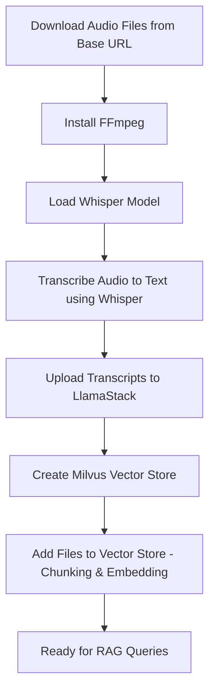

# Kubeflow ASR Conversion Pipeline for RAG

This document explains the **Kubeflow ASR (Automatic Speech Recognition) Conversion Pipeline** - a Kubeflow pipeline that processes audio files using Automatic Speech Recognition (ASR) with Whisper to extract transcripts and generate embeddings for Retrieval-Augmented Generation (RAG) applications. The pipeline supports execution on both GPU and CPU-only nodes.

> Note: This demo was tested using the default KServe behavior on OpenShift AI (`Headless` RawDeployment). If you are using `Headed` mode, change the `VLLM_URL` port to `80` in the [llamastackdistribution.yaml](../../common-deployments/llamastackdistribution.yaml).

## Pipeline Overview
The pipeline transforms audio files into searchable vector embeddings through the following stages:

## Supported Audio Formats

-  `.wav`
-  `.m4a`
-  `.mp3`
-  `.flac`
-  `.ogg`
-  `.aac`

In fact, Whisper model works exceptionally well with **WAV files**. It's the ideal format to use.

## 🚀 Getting Started
### Prerequisites

- Red Hat OpenShift AI v3.0+
- Data science project created with a configured pipeline server and workbench with Python 3.12.
- LlamaStack Operator enabled in the DSC resource. See [Working with Llama Stack](https://docs.redhat.com/en/documentation/red_hat_openshift_ai_self-managed/3.0/html/working_with_llama_stack/index).
- LlamaStackDistribution deployed and configured with the `qwen3-14b-awq` instruct model:
    - See [common-deployments](../../common-deployments). Apply the Qwen3 model first, and once it's ready, apply the llamastackdistribution resource.
    - Alternatively, you can use your own instruct model.
- 1–2 NVIDIA GPUs (one for the instruct model, and optionally one for the pipeline run)

### Import and run the KubeFlow Pipeline

Import the "[asr_rag_pipeline_compiled.yaml](asr_rag_pipeline_compiled.yaml)" KubeFlow Pipeline into your pipeline server, then run the pipeline to insert your audio files into the vector store.

When running the pipeline, you can customize the following parameters:

**Pipeline Parameters**
- `base_url`: The base web URL where the source audio files are located.
- `audio_filenames`: Comma-separated list of audio filenames to download from the base_url
- `vector_store_name`: Milvus vector store name
- `service_url`: Milvus service URL
- `embedding_model_id`: Embedding model to use
- `max_tokens`: Maximum tokens per chunk
- `chunk_overlap_tokens`: Chunk overlap size in tokens
- `use_gpu`: Enable/disable GPU acceleration

> Note: The compiled pipeline was generated by running `python asr_rag_pipeline.py`.

## Prompt the LLM

Once your files are embedded and indexed, you can query them by running through the example notebook [asr_rag_responses.ipynb](asr_rag_responses.ipynb)

1. In your Jupyter Notebook environment import the [requirements.txt](requirements.txt) file and the [asr_rag_responses.ipynb](asr_rag_responses.ipynb) notebook.

2. After installing the dependencies from the `requirements.txt` file, restart the `kernel` to apply the updates.

3. Then run through the RAG Jupyter Notebook `asr_rag_responses.ipynb` to query the content ingested by the pipeline.

## Additional Feature (Optional) - RAGAS
In the same example notebook [asr_rag_responses.ipynb](asr_rag_responses.ipynb), you can evaluate the RAG outputs using RAGAS.

We will use two key metrics to show the performance of the RAG server:

1. [Faithfulness](https://docs.ragas.io/en/stable/concepts/metrics/available_metrics/faithfulness/) - measures how factually consistent a response is with the retrieved context. It ranges from 0 to 1, with higher scores indicating better consistency.

2. [Response Relevancy](https://docs.ragas.io/en/stable/concepts/metrics/available_metrics/answer_relevance/) - metric measures how relevant a response is to the user input. Higher scores indicate better alignment with the user input, while lower scores are given if the response is incomplete or includes redundant information.