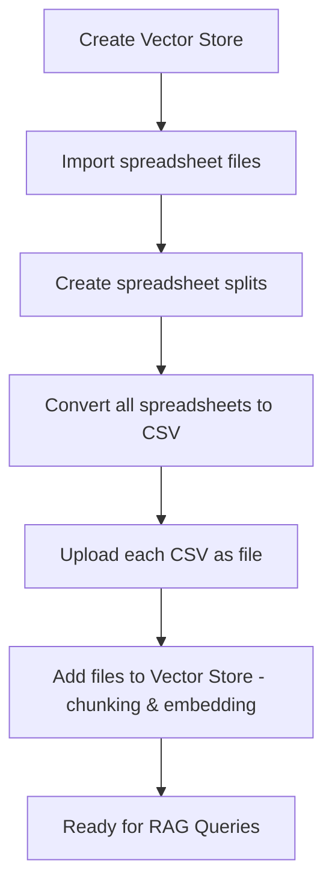

# Kubeflow Spreadsheets Conversion Pipeline for RAG
This document explains the **Kubeflow Spreadsheets Conversion Pipeline** - a Kubeflow pipeline that processes spreadsheets ("*.csv", "*.xlsx", "*.xls", "*.xlsm"), converts Excel to CSV with pandas, uploads each as a file, and adds them to a vector store for the Retrieval-Augmented Generation (RAG) applications. The pipeline supports execution on both GPU and CPU-only nodes.

> Note: This demo was tested using the default KServe behavior on OpenShift AI (`Headless` RawDeployment). If you are using `Headed` mode, change the `VLLM_URL` port to `80` in the [llamastackdistribution.yaml](../../common-deployments/llamastackdistribution.yaml).

## Pipeline Overview
The pipeline transforms spreadsheet files into a vector store for RAG:




## Pipeline Components

### 1. **Create Vector Store** (`create_vector_store`)

-  **Purpose**: Creates an empty vector store for file_search (Responses API).


### 2. **Spreadsheets Import** (`import_spreadsheet_files`)

-  **Purpose**: Downloads spreadsheet files from remote URLs.


### 3. **Spreadsheets Splitting** (`create_spreadsheet_splits`)

-  **Purpose**: Distributes spreadsheet files across multiple parallel workers for faster processing.


### 4. **Convert and Upload Spreadsheets** (`convert_and_upload_spreadsheets`)

-  **Purpose**: Converts Excel to CSV with pandas, uploads each CSV as a file via `client.files.create`, and adds it to the vector store with `client.vector_stores.files.create`.

## Supported Spreadsheets Formats

-  `.csv`

-  `.xlsx`

-  `.xls`

-  `.xlsm`


## 🔄 RAG Query Flow

1.  **User Query** → Embedding Model → Query Vector

2.  **Vector Search** → Vector Database → Similar Data Chunks

4.  **Context Assembly** → Row Content + Source Metadata

5.  **LLM Generation** → Final Answer with Context from Spreadsheet


The pipeline enables rich RAG applications that can answer questions about spreadsheet content by leveraging the structured data extracted from spreadsheet files.


## 🚀 Getting Started

### Prerequisites
- Red Hat OpenShift AI v3.0+
- Data science project created with a configured pipeline server and workbench with Python 3.12.
- LlamaStack Operator enabled in the DSC resource. See [Working with Llama Stack](https://docs.redhat.com/en/documentation/red_hat_openshift_ai_self-managed/3.0/html/working_with_llama_stack/index).
- LlamaStackDistribution deployed and configured with the `qwen3-14b-awq` instruct model:
    - See [common-deployments](../../common-deployments). Deploy the components in this order: first apply `postgres-deployment.yaml` and `llama-stack-config.yaml`, then apply `qwen3-14b-awq-deployment.yaml` and wait for it to be ready, and finally apply `llamastackdistribution.yaml`.
    - Alternatively, you can use your own instruct model.
- 1–2 NVIDIA GPUs (one for the instruct model, and optionally one for the pipeline run)


**Pipeline Parameters**

-  `base_url`: URL where spreadsheet files are hosted

-  `spreadsheet_filenames`: Comma-separated list of spreadsheet files to process

-  `num_workers`: Number of parallel workers (default: 1)

-  `vector_store_name`: Name of the vector store (for file_search / Responses API)

-  `service_url`: URL of the LlamaStack service

-  `embedding_model_id`: Embedding model to use (default: `sentence-transformers/ibm-granite/granite-embedding-125m-english`)

-  `max_tokens`: Maximum tokens per chunk (default: 512)

-  `chunk_overlap_tokens`: Chunk overlap in tokens (default: 64)

-  `use_gpu`: Whether to use GPU for processing (default: false)


### Creating the Pipeline for running on GPU node

```
# Install dependencies for pipeline
cd demos/kubeflow-pipelines/spreadsheets-conversion
pip3 install -r requirements.txt

# Compile the Kubeflow pipeline for running with help of GPU or use existing pipeline
# set use_gpu = True in spreadsheet_convert_pipeline() in spreadsheets_convert_pipeline.py
python3 spreadsheets_convert_pipeline.py
```

### Creating the Pipeline for running on CPU only
```
# Install dependencies for pipeline
cd demos/kubeflow-pipelines/spreadsheets-conversion
pip3 install -r requirements.txt

# Compile the Kubeflow pipeline for running on CPU only or use existing pipeline
# set use_gpu = False in spreadsheet_convert_pipeline() in spreadsheets_convert_pipeline.py
python3 spreadsheets_convert_pipeline.py
```

### Import Kubeflow pipeline to OpenShift AI
- Import the compiled YAML to in Pipeline server in your Data Science project in OpenShift AI
	- [Running a data science pipeline generated from Python code](https://docs.redhat.com/en/documentation/red_hat_openshift_ai_cloud_service/1/html/openshift_ai_tutorial_-_fraud_detection_example/implementing-pipelines#running-a-pipeline-generated-from-python-code)
- Configure the pipeline parameters as needed

### Prompt the LLM (Responses API)

Once your files are embedded and indexed, query them using the Responses API by running [spreadsheets_rag_responses.ipynb](spreadsheets_rag_responses.ipynb) (same pattern as [asr-conversion/asr_rag_responses.ipynb](../asr-conversion/asr_rag_responses.ipynb)).

1. In your Workbench, clone the repo and open the notebook. Install deps: `pip3 install -r requirements.txt` from the `spreadsheets-conversion` directory, then restart the kernel.
2. Run through the notebook to prompt the LLM with `client.responses.create()` and `file_search` (vector stores), and optionally evaluate with RAGAS.

> **Note:** The notebook expects a vector store named `csv-vector-store` (or change it in the notebook). This pipeline creates and populates that vector store.